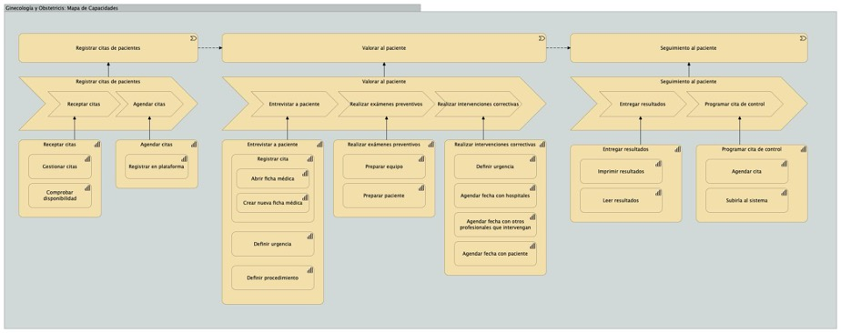
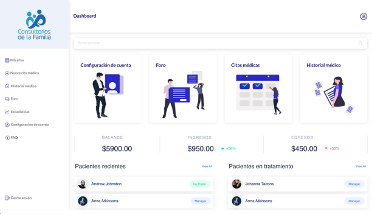

# Desarrollo de aplicación web en React (solo Front-End)

## Autor
**Juan Alberto García Bustamante**
- Tecnología en Transformación Digital de Empresas
- 4to ciclo

## La empresa
Consultorios de la Familia en un edificio de consultorios médicos que busca identificarse como un referente de salud, bienestar y estética para la familia.

Se centra en la prevención, el cuidado de la salud y la estética femenina y masculina brindando así una mejor calidad de vida a los pacientes.

Cuenta con profesionales como ginecólogos, cirujanos plásticos, laboratoristas, entre otros; con equipos de última generación que prestan un servicio de calidad a la población.

## Mapa de Capacidades

 

## Aplicación objetivo

Se propone la elaboración de una plataforma web donde el doctor suba los resultados médicos del cliente y los pueda enviar vía whatsapp al paciente.
